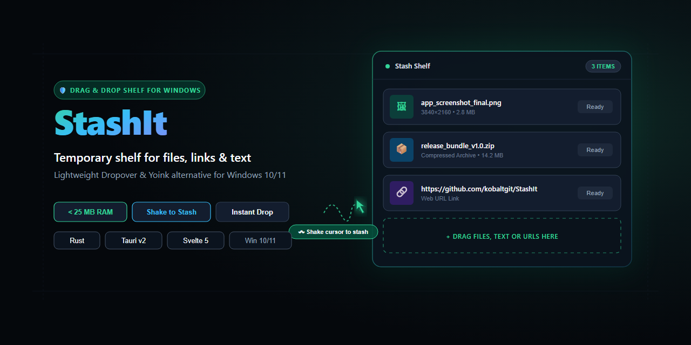
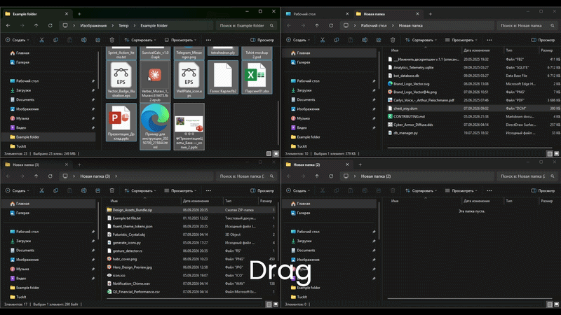

<p align="center">
  
</p>

<p align="center">
  
  <h1 align="center">StashIt</h1>
  <strong>Легковесный плавающий карман Drag-and-Drop (Dropover / Yoink для Windows) на Rust и Tauri v2.</strong><br/>
  <em>Lightweight drag-and-drop shelf (Dropover / Yoink alternative) for Windows 10 & 11 built with Rust & Tauri v2.</em>
</p>

<p align="center">
  <a href="https://github.com/kobaltgit/StashIt/releases/latest"></a>
  <a href="https://kobaltgit.github.io/StashIt/"></a>
  
  
  
  
  
  <a href="LICENSE"></a>
</p>

<p align="center">
  <a href="#-о-проекте">🇷🇺 Русский</a> • <a href="#-about-the-project">🇬🇧 English</a> • <a href="#-экосистема-kobalt-tools">🌐 Экосистема</a>
</p>

<p align="center">
  
</p>

---

## 🇷🇺 О проекте

**StashIt** — сверхлегковесный нативный плавающий карман для Windows 10 & 11, входящий в экосистему системных инструментов **Kobalt Tools** ([MiniBin](https://github.com/kobaltgit/minibin), [Undoit](https://github.com/kobaltgit/undoit), [PolyShift](https://github.com/kobaltgit/polyshift), [PeekIt](https://github.com/kobaltgit/peekit)).

Служит временным буфером для перетаскивания файлов, картинок, веб-ссылок и текста при навигации между папками и рабочими пространствами. В состоянии покоя приложение **100% невидимо**. Карман вызывается прямо у курсора по лёгкой встряске мыши при перетаскивании (Shake), глобальному хоткею, двойному нажатию клавиши или выдвигается от края экрана (Edge Dock). Все способы можно гибко настроить в меню приложения.

Потребляет **менее 25 МБ RAM** благодаря ядру на **Rust 2021** и реактивному интерфейсу на **Svelte 5** под движком **Tauri v2**.

### ⚡ Сравнение с аналогами

| Параметр | StashIt | Dropover (macOS) | DropPoint (Windows / Electron) |
| :--- | :--- | :--- | :--- |
| **Стек технологий** | **Rust + Tauri v2 + Svelte 5** | Swift / macOS Native | Electron + Node.js |
| **Платформа** | **Windows 10 & 11** | macOS Only | Windows / Linux / macOS |
| **ОЗУ в фоне** | **15–20 МБ** | 25–40 МБ | 150–300 МБ |
| **Холодный запуск** | **~50 мс** | Нативно macOS | 1.5–2.5 сек |
| **Размер установщика** | **~4.5 МБ** | App Store | > 80 МБ |
| **Права администратора** | **Не требуются (чистый HKCU)** | Не требуются | Зависит от пакета |

### 🎯 Ключевые возможности

- 🫨 **Встряска мыши (Shake to Show):** Зажмите файл и качните мышь — карман появится прямо рядом с курсором (как в Dropover).
- ⌨️ **Глобальный хоткей (Global Shortcut):** Мгновенный вызов и скрытие по комбинации клавиш (по умолчанию `Ctrl + Shift + Space`, `Alt + S`, `Ctrl + Alt + S`, `Win + Alt + S`).
- ⚡ **Двойное нажатие клавиши (Double-tap Modifier):** Быстрое двойное нажатие `Ctrl` или `Shift` для вызова кармана одной рукой без сложных аккордов.
- 🧲 **Край экрана (Edge Dock / Шторка):** Подведите курсор к кромке экрана — карман автоматически выдвинется навстречу; если мышь ушла и карман пуст — аккуратно свернется.
- 📦 **Захват всей стопки:** Перетаскивание как отдельных файлов, так и всей пачки сразу через мастер-ручку.
- ⏳ **Умный таймер автоочистки (5 сек):** Мягкий обратный отсчёт после переноса файлов; карман скрывается автоматически.
- 📋 **Умный двойной буфер и Drag-out заметок:** При копировании или переносе заметок StashIt отдает сразу два формата: в текстовые редакторы вставляется текст, а в папки Проводника — готовые файлы `.txt` и `.url`.
- 🔄 **Встроенная проверка обновлений и Раздел «О программе»:** Двухвкладочная панель настроек («Управление» и «О программе»), вызов из меню трея, прямое скачивание новых релизов с GitHub и тихие уведомления.
- 🎨 **Адаптивный Fluent Acrylic интерфейс:** Тёмная, светлая и системная темы с акриловым размытием.
- 🚀 **Безопасная автозагрузка:** Запуск через реестр `HKCU` без запросов UAC.

### 📥 Установка и загрузка

Скачайте актуальную версию со [страницы последнего релиза](https://github.com/kobaltgit/StashIt/releases/latest):

- **Инсталлятор (`Setup.exe` или `.msi`):** Быстрая установка без прав администратора.
- **Portable версия (`.zip`):** Запуск в один клик без инсталляции.

---

## 🇬🇧 About the Project

**StashIt** is an ultra-lightweight, native drag-and-drop shelf for Windows 10 & 11 and part of the **Kobalt Tools** desktop ecosystem ([MiniBin](https://github.com/kobaltgit/minibin), [Undoit](https://github.com/kobaltgit/undoit), [PolyShift](https://github.com/kobaltgit/polyshift), [PeekIt](https://github.com/kobaltgit/peekit)).

It acts as a temporary holding shelf for files, images, URLs, and text snippets while you navigate between folders and workspaces. When idle, the app is **100% invisible**. Summon the shelf right next to your mouse pointer via mouse shake while dragging (Shake), global hotkey, double-tapping modifier keys, or edge docking drawer mode. All methods are fully configurable in the settings.

Consumes **under 25 MB RAM** built with native **Rust 2021** and **Svelte 5** under **Tauri v2**.

### ⚡ Key Benchmarks

| Metric | StashIt | Dropover (macOS) | DropPoint (Windows / Electron) |
| :--- | :--- | :--- | :--- |
| **Tech Stack** | **Rust + Tauri v2 + Svelte 5** | Swift / macOS Native | Electron + Node.js |
| **Platform** | **Windows 10 & 11** | macOS Only | Windows / Linux / macOS |
| **Idle RAM** | **15–20 MB** | 25–40 MB | 150–300 MB |
| **Cold Launch** | **~50 ms** | macOS Native | 1.5–2.5 sec |
| **Installer Size** | **~4.5 MB** | App Store | > 80 MB |
| **Admin Rights** | **Zero Admin (pure HKCU)** | Not required | Package dependent |

### 🎯 Core Features

- 🫨 **Shake to Show:** Hold and shake mouse while dragging files to instantly summon shelf at cursor position.
- ⌨️ **Global Shortcut:** Instant toggle at cursor with customizable hotkeys (default `Ctrl + Shift + Space`, `Alt + S`, `Ctrl + Alt + S`, `Win + Alt + S`).
- ⚡ **Double-tap Modifier:** Quick double-tap of `Ctrl` or `Shift` to summon the shelf with one hand without keyboard acrobatics.
- 🧲 **Screen Edge Dock (Auto-expand Drawer):** Hover the cursor against the screen edge to expand the shelf; automatically collapses when the mouse moves away if empty.
- 📦 **Batch Drag Handle:** Drag all stashed files or selected items simultaneously with one gesture.
- ⏳ **Smart Auto-Clear Countdown (5s):** Automatically clears and hides the shelf after files are moved out.
- 📋 **Smart Dual Clipboard & Note Drag-out:** When copying or dragging notes, StashIt provides both text and file formats simultaneously: text editors get text, while Windows Explorer folders get real `.txt` and `.url` files!
- 🔄 **Built-in GitHub Release Updater & "About" Section:** Tabbed settings UI ("Controls" and "About"), direct tray menu entry, instant downloads for new releases, and silent toast notifications.
- 🎨 **Fluent Acrylic UI:** Beautiful dark and light themes matching Windows 11 aesthetics.
- 🚀 **Clean User-Mode Startup:** Registry-based autorun in `HKCU` without intrusive UAC popups.

### 📥 Installation & Download

Download the latest version from [GitHub Releases](https://github.com/kobaltgit/StashIt/releases/latest):

- **Installer (`Setup.exe` / `.msi`):** Fast user-mode installer, no administrator rights needed.
- **Portable (`.exe`):** Single standalone executable, run anywhere without installation.

---

## 🛠️ Сборка и разработка / Development

```bash
# 1. Установка зависимостей фронтенда
npm install

# 2. Запуск в режиме разработки (Hot Reload)
npm run tauri dev

# 3. Сборка релизного установщика
npm run tauri build
```

---

## 🌐 Экосистема Kobalt Tools

| Проект | Описание | Стек | Ссылки |
| :--- | :--- | :--- | :--- |
| 📥 **StashIt** | Плавающий карман Drag-and-Drop (Dropover / Yoink для Windows) | Rust + Tauri v2 + Svelte 5 | [Repo](https://github.com/kobaltgit/StashIt) • [Web](https://kobaltgit.github.io/StashIt/) |
| 🗑️ **MiniBin** | Умная корзина в системном трее с Flyout-интерфейсом | Rust + Tauri v2 + Svelte 5 | [Repo](https://github.com/kobaltgit/minibin) • [Web](https://kobaltgit.github.io/minibin/) |
| ⏱️ **Undoit** | Локальная машина времени и версионирование файлов (Ctrl+Z) | Rust + Tauri v2 + Svelte 5 | [Repo](https://github.com/kobaltgit/undoit) • [Web](https://kobaltgit.github.io/Undoit/) |
| 🌐 **PolyShift** | HUD-помощник и контекстный перевод у курсора с Gemini AI | Rust + Tauri v2 + Svelte 5 | [Repo](https://github.com/kobaltgit/polyshift) • [Web](https://kobaltgit.github.io/polyshift/) |
| 👁️ **PeekIt** | Мгновенный предпросмотр файлов по клавише Space | Rust + Tauri v2 + Svelte 5 | [Repo](https://github.com/kobaltgit/peekit) • [Web](https://kobaltgit.github.io/PeekIt/) |
| 🧩 **PeekIt Plugins** | Официальный реестр и SDK веб-плагинов для PeekIt | TypeScript + Web SDK | [Repo](https://github.com/kobaltgit/peekit-plugins) • [Web](https://kobaltgit.github.io/peekit-plugins/) |
| 🎨 **kobalt_ui** | Общая библиотека UI компонентов (шапка, футер, релизы) | Flutter Web (Dart) | [Repo](https://github.com/kobaltgit/kobalt_ui) |

---

## 📄 Лицензия / License

Распространяется под лицензией **MIT**. Подробнее в файле [LICENSE](LICENSE).
